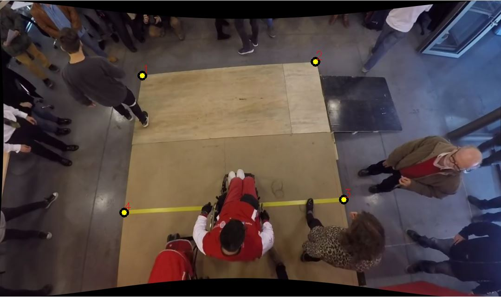

# Faster_RCNN_HT
In this work we dealead with detection and tracking of human heads under non-ideal conditions, like public transportation.

The tracking algorithm was executed with Kalman and linear assignment (hungarian algorithm).
The management of detections was realized with a trained network by Tensorflow. It was implemented by Faster RCNN with InceptionV2

The network is the same as https://github.com/PauloAguayo/DensidadDePasajerosMovilidadReducida . The only difference with this job is that we only use head detection. For this reason, the database is the same.

In folder "Faster_RCNN" you can find the model ".pb" and the labels ".pbtxt".

The code allows you to see the detections through the screen, and in parallel, it writes a "csv" file with timestamps, frames, density and different kind of detections, like current detections, total detections and new detections; beside, it can show online charts related to current detections; and finally, it can make recordings of both process in only one frame.

In folder "Results" can be found the results of the algorithm, like videos and/or csv files.

# Install
A virtual environment must be created with the next libraries:

- Python >=3.0
- Tensorflow 1.14
- Numpy
- OpenCV
- Filterpy
- Numba
- scikit-learn==0.22.2
- Matplotlib

# Parser
The program holds 11 parser variables, which only 2 are required. This are:

- '-m' (required): Route and model ".pb".
- '-l' (required): Route and labels name ".pbtxt".
- '-i' (optional): Route and video name. Otherwise, it will turn the camera on.
- '-c' (optional): Confidence for detection. Default = 0.75.
- '-r' (optional): Resize of frames. Default=1080,640. The same structure procedure as Default must be followed.
- '-s' (optional): Action variable. A total detection counter gets on the screen.
- '-g' (optional): Action variable. It activates the online charts about current detections.
- '-w' (optional): Temporary window for the data flow in charts. Default=300.
- '-rec' (optional): Route, name and output video format.
- '-cal' (optional): Action variable. Option for un-distort images, like fisheye lens.
- '-lim' (optional): Variable to warn about an overcrowding. Default = 5 (people).

# Instructions
Once you enter the parser variables (like in example), the program will require you to select the area to be measured through points, like a polygon. Those are 3 as a minimum. by secuence. So the order is important.  
For each point you want to select, you must doble click and the press "a".  
In case you get wrong, only press "r" and all your selected points will not be considered.  
To move on, press "esc".  

Next, the program will ask if you know polygon's area. If you do, press "y" and then enter the value in square meters. If you don't, press "n" and then select an area in the frame as reference for a square meter.  

Finally, the program will be running.  

# Example
$ python main.py -m Faster_RCNN/frozen_inference_graph.pb -l Faster_RCNN/labelmap.pbtxt  -i Videos/GOPRO.mp4

# Acknowledgments
- https://github.com/ZidanMusk/experimenting-with-sort
- https://github.com/tensorflow/models
- https://ffmpeg.org/
- https://medium.com/@kennethjiang/calibrate-fisheye-lens-using-opencv-part-2-13990f1b157f
- https://medium.com/@kennethjiang/calibrate-fisheye-lens-using-opencv-333b05afa0b0
